# Data Visualization Projects
---

This repository contains detailed explanations about different approaches that I have used in Data Visualization problems. 

<u>Table of contents</u>
=======

<!--ts-->
  - [Project 1 - Intoxication Behavior](#project-1---intoxication-behavior)
      - [Problem Statement ](#problem-statement-1)
  - [Project 2 - Dimension Reduction](#project-2---dimension-reduction)
      - [Problem Statement](#problem-statement-2)
      - [Data Analysis & Preprocessing](#project2-2)
      - [Visualization](#visualization2)
<!--te-->

---

## Project 1 - Intoxication Behavior
#### Problem Statement 
Content for Problem Statement 1 goes here.

---
## Project 2 - Dimension Reduction

#### Problem Statement 
The dataset provides valuable insights into breast cancer diagnoses, with a focus on various attributes related to tumor characteristics. The main goal of this project is to detect hidden patterns between various attributes within the dataset by utilizing data visualization methods.

#### Data Analysis & Preprocessing 
The dataset includes 569 samples with 32 dimensions, comprising patient IDs, diagnosis status, and 30 tumor-related features. The dataset can be divided into three subsets, each consisting of 10 features:

  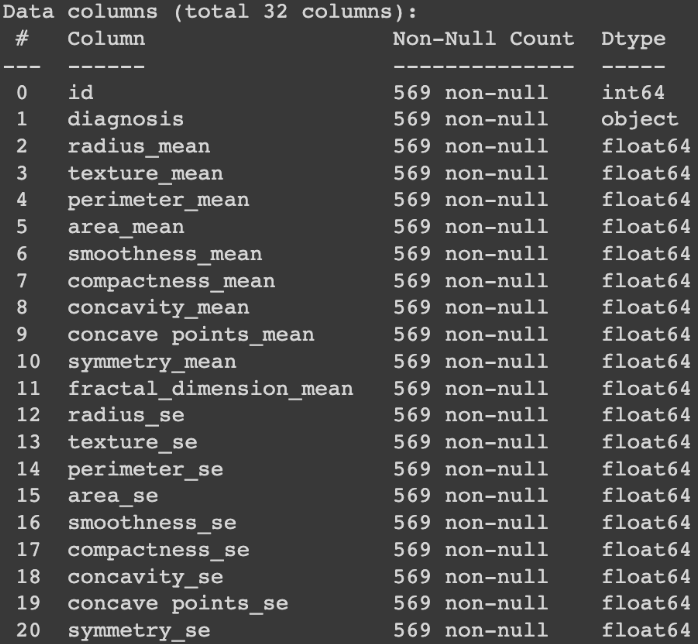
  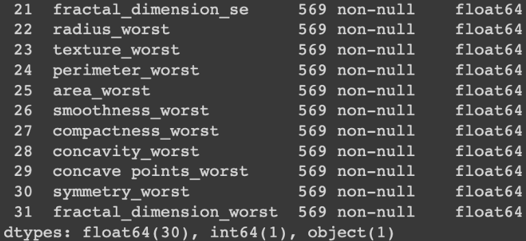

  
Tumor Geometry
- Radius: Mean distance from center to perimeter points
- Texture: Standard deviation of gray-scale values
- Perimeter: Perimeter measurement
- Area: Area measurement
 

Tumor Smoothness
- Smoothness: Local variation in radius lengths
- Compactness: Computed as (perimeter^2) / area - 1.0
- Concavity: Severity of concave portions of the contour
- Concave Points: Number of concave portions of the contour
 

Tumor Symmetry
- Symmetry: Symmetry of tumor
- Fractal Dimension: Fractal dimension of tumor
  

<!--  -->

To effectively utilize this dataset for visualization and future modeling, it's essential to ensure that all variables are in numeric format. The dataset primarily comprises numeric attributes, with one exception: the "Diagnosis" column. It contains two parameters:  
- "Malignant" cases indicate tumors that are potentially dangerous and have spread significantly.
- "Benign" cases refer to tumors that are less dangerous and have not spread extensively.

To prepare the dataset for analysis, we will convert the "Diagnosis" variable into a numeric format, enabling us to employ various visualization techniques and modeling approaches effectively.

#### Visualization  
After preprocessing phase, let's start with visualization and utilizing various visualization techniques to gather more concise understanding.

  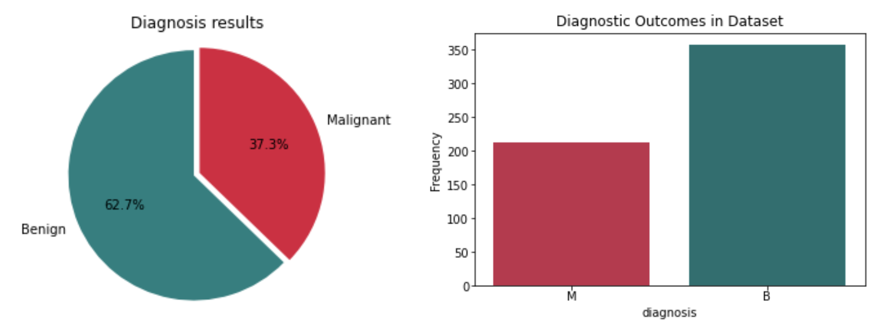

 

Next, the analysis involves visualizing the remaining 30 features to explore their relationships. histogram visualizations are provided for the mean, standard error (SE), and worst-case features. These visualizations offer a clear view of each variable's behavior.

  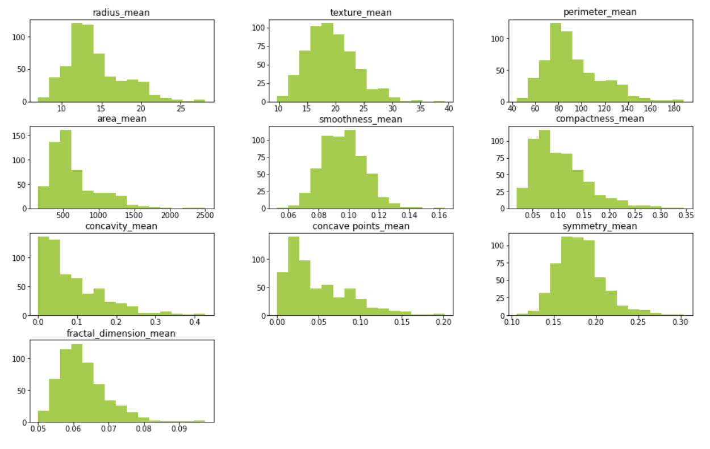

  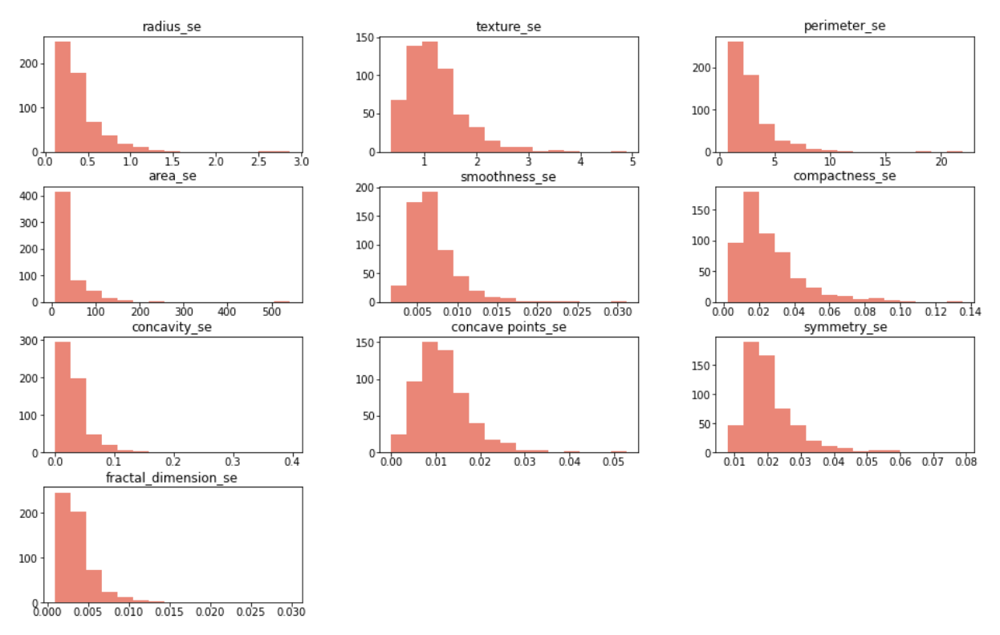

  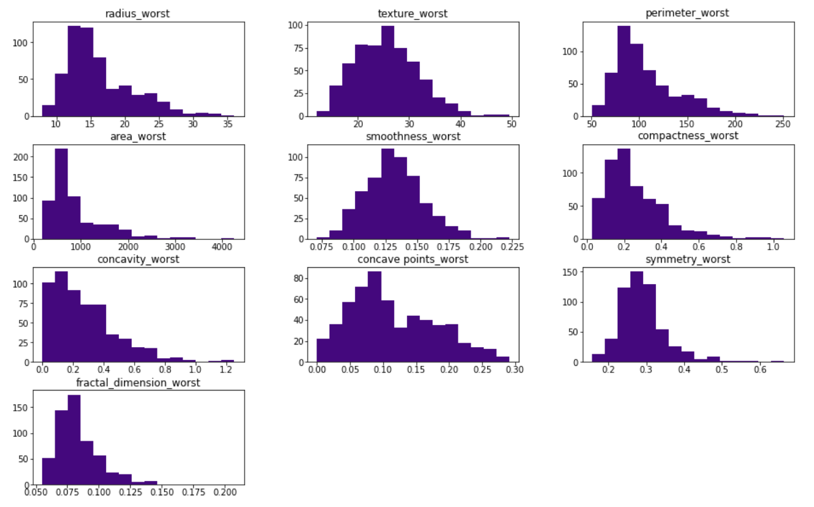

 

Also, density plots were employed to provide a visual representation. These plots effectively reveal exponential behavior within various variables. For instance, the plots clearly indicate that the variables "area," "compactness," and "fractal_dimension" exhibit exponential distributions.

  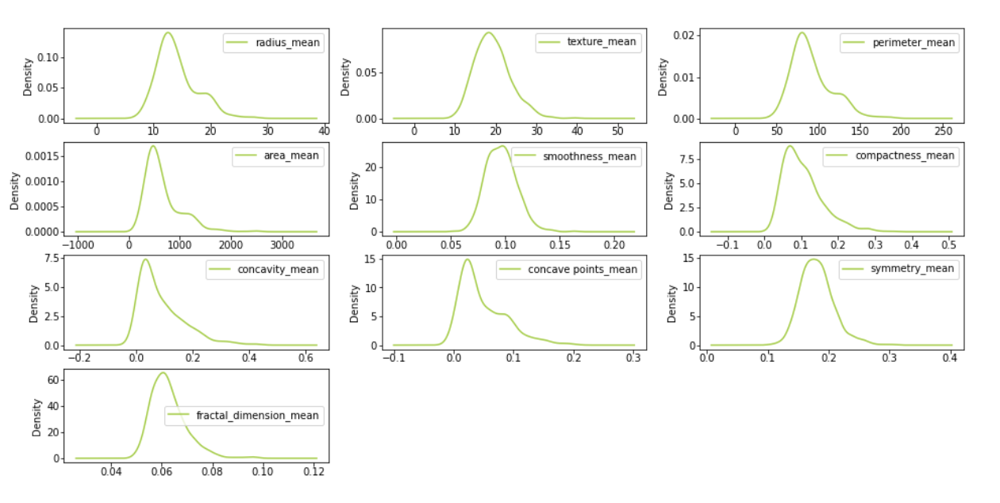

  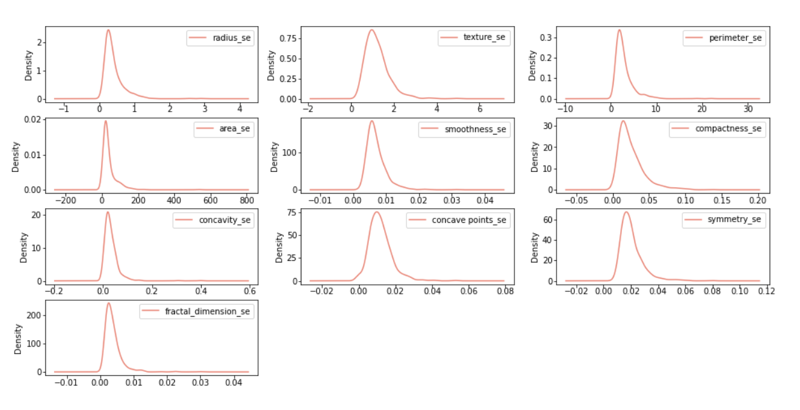

  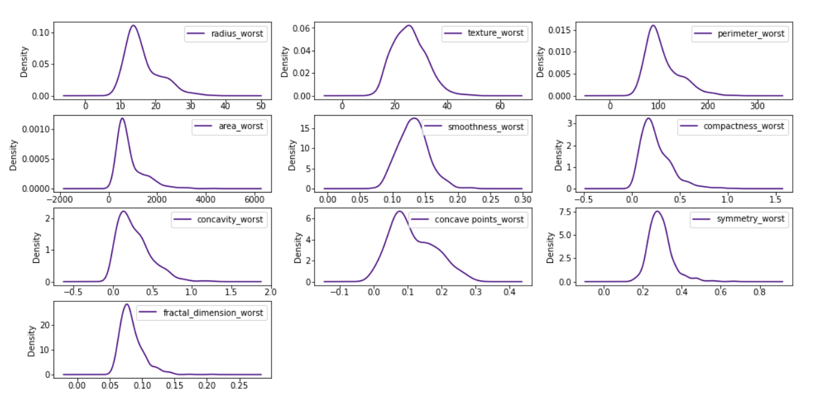

 

At this stage, sufficient knowledge about the dataset has been acquired, enabling us to proceed with the visualization of a heatmap. There is a potential usage of heatmap for dimension reduction to observe the correlations between all features of the dataset.

  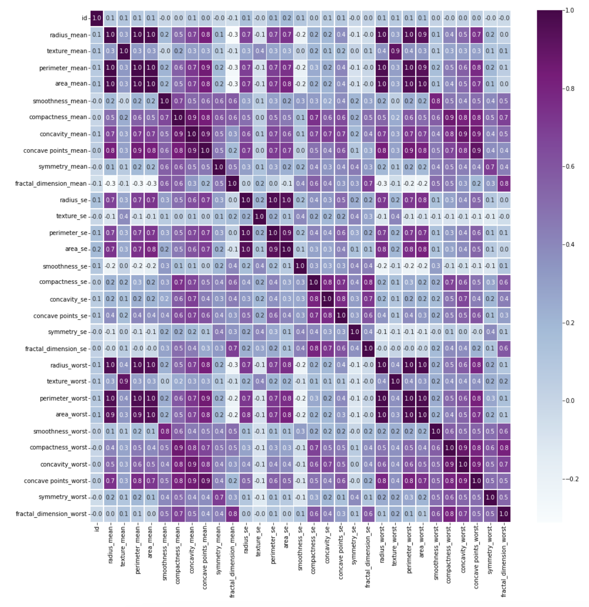

 

In the pursuit of feature selection, a comprehensive comparison was conducted among the subsets (mean, SE, and worst). Notably, correlations emerged within these subsets.
This process continued iteratively until no fully correlated features, characterized by a correlation coefficient of 1, remained in the heatmap. 

  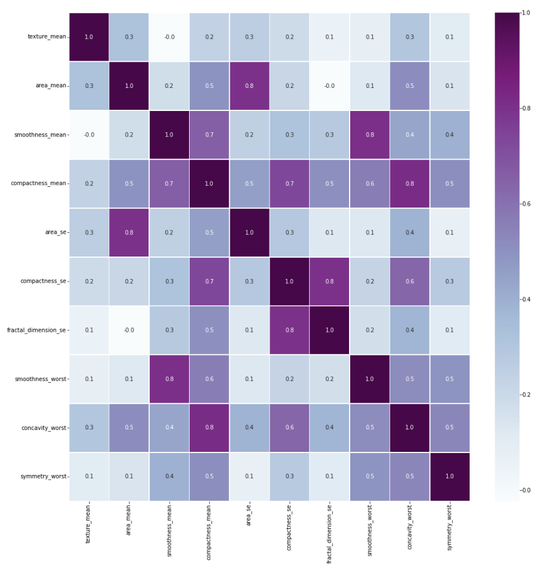

