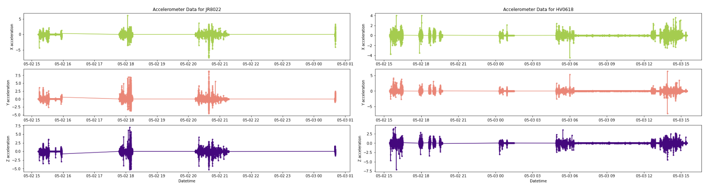

# Data Visualization Projects
---

This repository contains detailed explanations of various data visualization approaches I have used to uncover hidden patterns within datasets and attributes.

<u>Table of contents</u>
=======

<!--ts-->
  - [Project 1 - Intoxication Behavior](#project-1---intoxication-behavior)
      - [Problem Statement ](#problem-statement-1)
      - [Data Analysis & Preprocessing](#project1-2)
      - [Visualization](#visualization1)
  - [Project 2 - Breast Cancer Diagnosis](#project-2---dimension-reduction)
      - [Problem Statement](#problem-statement-2)
      - [Data Analysis & Preprocessing](#project2-2)
      - [Visualization](#visualization2)
<!--te-->

---

## Project 1 - Intoxication Behavior
#### Problem Statement 
In the realm of public health and safety, the issue of intoxication behavior poses significant challenges. Understanding and effectively addressing this problem is crucial for ensuring the well-being of individuals and communities alike. The main focus of this data visualization project is on detecting hidden patterns in intoxication behavior data. By uncovering these patterns, we aim to provide valuable insights for improving public health and safety measures.

#### Data Analysis & Preprocessing 

This dataset forms the basis of a research study conducted with 13 participants, representing a substantial and intricate dataset. The primary challenge in visualizing this dataset lies in the division of valuable data between two distinct datasets: accelerometer and TAC (Transdermal Alcohol Content). The accelerometer dataset comprises 14,057,567 records across five dimensions, encompassing Participant ID (PID), time, and participant acceleration in the X, Y, and Z directions. The accelerometer data was collected using mobile devices for each participant. Conversely, the TAC dataset contains PID and TAC values at specific timestamps, representing the Transdermal Alcohol Content, providing a critical link between an individual's alcohol level and their movement patterns. Our core objective is to establish meaningful relationships between TAC levels and participant mobility, contributing to a deeper understanding of the data.

#### Visualization  

As illustrated in the first figure below, the movement behavior of user BK7610 is distinctly evident. This visualization is generated using the accelerometer dataset and its respective dimensions, including X, Y, and Z. It allows us to observe real-time variations in these specific directions, offering insights across various timestamps throughout the day. For a comprehensive understanding of the participants' behavior, similar plots have been created for all other users and are individually presented. Explore the remaining visualizations below.

  

 

  

 

  

 

  

 

  

 

  

 

  

 

Following our analysis of the accelerometer dataset, our focus now shifts to the TAC dataset, where we explore the relationship between each participant's TAC levels and the temporal variations within them. As depicted here, we present a comprehensive view of the TAC level fluctuations over the course of a day for all participants. Each participant is represented by a specific color, and a red threshold line at 0.08, signifying the legal TAC limit, enhances the interpretability of the visualization. Values above this threshold indicate intoxication, while values below signify sobriety, offering valuable insights into participants' alcohol levels during specific time intervals.

  

 

Also here Is the visualization of sober and intoxicated data, offering both frequency and percentage versions to enhance comprehension. It also illustrates the percentage distribution of sober and intoxicated values for each participant. These comprehensive visualizations encapsulate the essential insights within the dataset, highlighting significant relationships throughout its entirety. Moreover, our approach of providing detailed, individual visualizations for each participant serves as a valuable resource for future research opportunity.

  

 

  

 

---
## Project 2 - Breast Cancer Diagnosis 

#### Problem Statement 
The dataset provides valuable insights into breast cancer diagnoses, with a focus on various attributes related to tumor characteristics. The main goal of this project is to detect hidden patterns between various attributes within the dataset by utilizing data visualization methods.

#### Data Analysis & Preprocessing 
The dataset includes 569 samples with 32 dimensions, comprising patient IDs, diagnosis status, and 30 tumor-related features. The dataset can be divided into three subsets, each consisting of 10 features:

  &nbsp;&nbsp;&nbsp;
  

  
Tumor Geometry
- Radius: Mean distance from center to perimeter points
- Texture: Standard deviation of gray-scale values
- Perimeter: Perimeter measurement
- Area: Area measurement
 

Tumor Smoothness
- Smoothness: Local variation in radius lengths
- Compactness: Computed as (perimeter^2) / area - 1.0
- Concavity: Severity of concave portions of the contour
- Concave Points: Number of concave portions of the contour
 

Tumor Symmetry
- Symmetry: Symmetry of tumor
- Fractal Dimension: Fractal dimension of tumor
  

<!--  -->

To effectively utilize this dataset for visualization and future modeling, it's essential to ensure that all variables are in numeric format. The dataset primarily comprises numeric attributes, with one exception: the "Diagnosis" column. It contains two parameters:  
- "Malignant" cases indicate tumors that are potentially dangerous and have spread significantly.
- "Benign" cases refer to tumors that are less dangerous and have not spread extensively.

To prepare the dataset for analysis, we will convert the "Diagnosis" variable into a numeric format, enabling us to employ various visualization techniques and modeling approaches effectively.

#### Visualization  
After preprocessing phase, let's start with visualization and utilizing various visualization techniques to gather more concise understanding.

  

 

Next, the analysis involves visualizing the remaining 30 features to explore their relationships. histogram visualizations are provided for the mean, standard error (SE), and worst-case features. These visualizations offer a clear view of each variable's behavior.

  

  

  

 

Also, density plots were employed to provide a visual representation. These plots effectively reveal exponential behavior within various variables. For instance, the plots clearly indicate that the variables "area," "compactness," and "fractal_dimension" exhibit exponential distributions.

  

  

  

 

At this stage, sufficient knowledge about the dataset has been acquired, enabling us to proceed with the visualization of a heatmap. There is a potential usage of heatmap for dimension reduction to observe the correlations between all features of the dataset.

  

 

In the pursuit of feature selection, a comprehensive comparison was conducted among the subsets (mean, SE, and worst). Notably, correlations emerged within these subsets.
This process continued iteratively until no fully correlated features, characterized by a correlation coefficient of 1, remained in the heatmap. 

  

